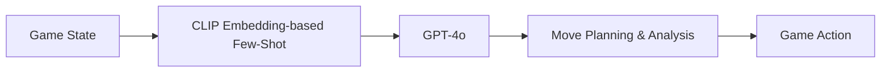

# Speedrunner

This Python application uses GPT-4 and CLIP to control an RPG game. The application uses AI to analyze the current game state and plan the next moves, aiming to play the game in a human-like manner.

## Features

- **Game State Analysis**: The application analyzes the current game state based on a screenshot and updates the game plan accordingly.
- **Move Planning**: The application plans the next moves based on the current game state and past game states.
- **Image Comparison**: The application compares the current and previous game screenshots to determine if progress is being made.
- **Orientation**: The application provides a detailed description of the surroundings in the game, including what can be found in each direction (up, down, left, right).
- **Example Moves**: The application provides relevant example previously captured gameplay as reference moves to improve the performance.
- **CLIP Embedding**: The application uses OpenAI's CLIP to convert images into vector embeddings for dynamic few-shot.

## System Diagram



## How to Run

1. Ensure you have Python 3.7+ installed.
2. Install the required packages using pip:
   ```
   pip install -r requirements.txt
   ```
3. Run the application:
   ```
   python app.py
   ```

## Note

This application is an experiment about giving GPT-4 control over a RPG game. It is intended for demonstration and educational purposes only.

## Contributing

Contributions are welcome! Please read the contributing guidelines before making any changes.